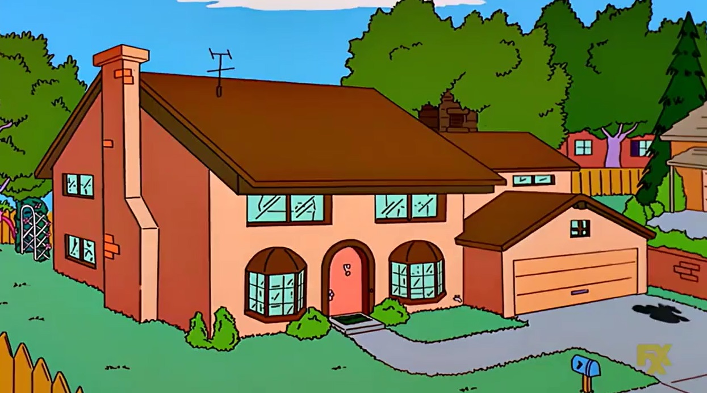
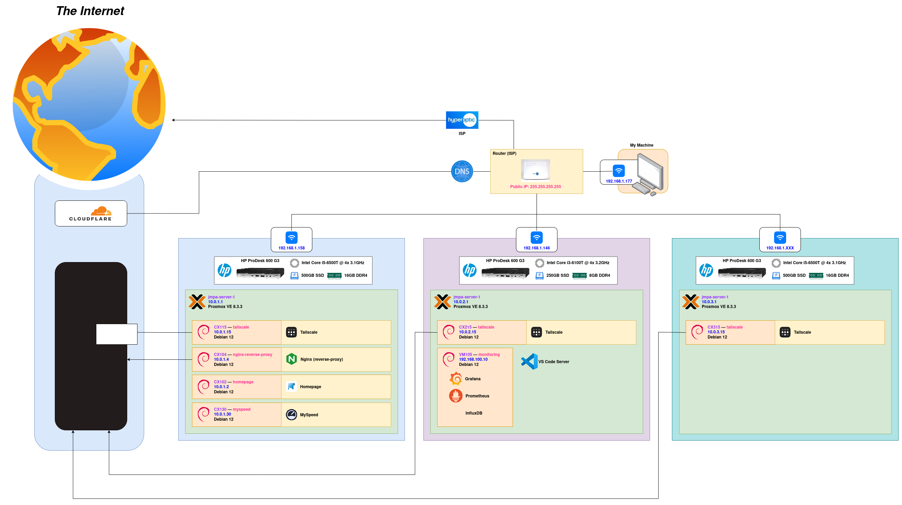

<!-- markdownlint-disable MD041 MD010 -->
<p align="center">
    
</p>

## `homelab`

```diff
+ 🏠 A collection of "things" that manage my homelab.
```
<a href="LICENSE" target="_blank"></a>
[](https://github.com/jmpa-io/homelab/actions/workflows/cicd.yml)
[](https://codecov.io/github/jmpa-io/homelab)

## `Architecture`

<p align="centre">
    
</p>

## `License`

This work is published under the MIT license.

Please see the [`LICENSE`](./LICENSE) file for details.
