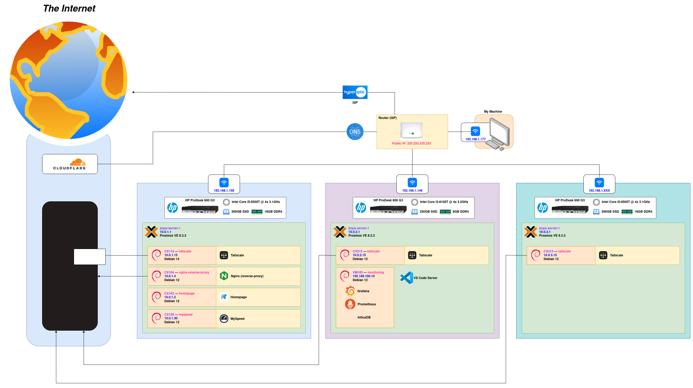

# Homelab Infrastructure

Complete GitOps-based homelab infrastructure running on Proxmox with K3s and ArgoCD.



## 🏗️ Architecture

```
┌─────────────────────────────────────────────────────────────────┐
│                    GitHub Repository (Source of Truth)           │
└────────────┬────────────────────────────────────┬───────────────┘
             │                                    │
             │ Infrastructure (Ansible)           │ Applications (GitOps)
             ↓                                    ↓
┌────────────────────────────┐      ┌────────────────────────────┐
│  GitHub Actions Runners    │      │        ArgoCD              │
│  (Self-hosted on K3s)      │      │  (Running on K3s)          │
└────────────┬───────────────┘      └────────────┬───────────────┘
             │                                    │
             │ Ansible Playbooks                  │ kubectl apply
             ↓                                    ↓
┌────────────────────────────┐      ┌────────────────────────────┐
│    Proxmox Cluster         │      │      K3s Cluster           │
│  • 3 nodes (HA)            │      │  • 3 masters + 6 workers   │
│  • LXC containers          │      │  • MetalLB LoadBalancer    │
│  • VMs                     │      │  • NFS storage             │
│  • Shared storage (NFS)    │      │  • Auto-scaling runners    │
└────────────────────────────┘      └────────────────────────────┘
```

## 🚀 Quick Start

### Prerequisites

- 3 Proxmox VE hosts (already configured)
- NAS with NFS exports
- GitHub account with repository access
- Ansible installed locally
- AWS account with SSM Parameter Store access

### 0. Populate AWS SSM Parameter Store

All secrets and host IPs are stored in AWS SSM — **nothing works until these exist.**
Run `make print-inventory` at any time to see exactly which ones are missing.

See **[docs/ssm-parameters.md](docs/ssm-parameters.md)** for the complete reference. Minimum required before `make print-inventory` works:

```bash
export AWS_REGION=ap-southeast-2

# SSH keys (or run: make upload-ssh-keys)
aws ssm put-parameter --name "/homelab/ssh-password"              --value "<me-user-password>"           --type SecureString
aws ssm put-parameter --name "/homelab/ssh/public-key"            --value "$(cat ~/.ssh/id_ed25519.pub)" --type String
aws ssm put-parameter --name "/homelab/ssh/private-key"           --value "$(cat ~/.ssh/id_ed25519)"     --type SecureString

# Network
aws ssm put-parameter --name "/homelab/subnet"                    --value "10.0.0.0"    --type String
aws ssm put-parameter --name "/homelab/internet-gateway"          --value "<router-ip>" --type String

# Proxmox API token (format: user@realm!tokenid=secret)
aws ssm put-parameter --name "/homelab/proxmox/api-token"         --value "me@pam!tokenid=secret" --type SecureString

# Proxmox host IPs
aws ssm put-parameter --name "/homelab/jmpa-server-1/ipv4-address" --value "<ip>" --type String
aws ssm put-parameter --name "/homelab/jmpa-server-1/device-name"  --value "jmpa-server-1" --type String
aws ssm put-parameter --name "/homelab/jmpa-server-2/ipv4-address" --value "<ip>" --type String
aws ssm put-parameter --name "/homelab/jmpa-server-2/device-name"  --value "jmpa-server-2" --type String
aws ssm put-parameter --name "/homelab/jmpa-server-3/ipv4-address" --value "<ip>" --type String
aws ssm put-parameter --name "/homelab/jmpa-server-3/device-name"  --value "jmpa-server-3" --type String

# NAS + DNS
aws ssm put-parameter --name "/homelab/jmpa-nas-1/ipv4-address"   --value "<ip>" --type String
aws ssm put-parameter --name "/homelab/jmpa-nas-1/device-name"    --value "jmpa-nas-1" --type String
aws ssm put-parameter --name "/homelab/jmpa-dns-1/ipv4-address"   --value "<ip>" --type String
aws ssm put-parameter --name "/homelab/jmpa-dns-1/device-name"    --value "jmpa-dns-1" --type String
```

Everything else (Tailscale, SSL, Grafana password, k3s token, Pi-hole API key, arr stack keys, etc.)
is **optional** — add each one as you bring that service online.
See [docs/ssm-parameters.md](docs/ssm-parameters.md) for the full breakdown.

### 1. Build the VM template (prerequisite for k3s)

k3s VMs are cloned from a Debian 12 cloud-init template. Run this once per Proxmox host:

```bash
ansible-playbook playbooks/proxmox-templates/debian-12-nocloud-amd64/main.yml \
  -i dist/inventory.json \
  --extra-vars "root_playbook_directory=$PWD"
```

### 2. Deploy K3s Cluster

```bash
# Deploy k3s cluster (VMs + k3s install + MetalLB)
make deploy-k3s

# Then configure storage and deploy services:
ansible-playbook playbooks/deploy-k3s-gitops.yml \
  -i dist/inventory.json \
  --extra-vars "root_playbook_directory=$PWD"

# Credentials are saved to:
# - services/vms/k3s/argocd-credentials.txt
```

### 3. Setup GitHub Self-Hosted Runners

```bash
# Create GitHub PAT secret
kubectl create secret generic controller-manager \
  -n actions-runner-system \
  --from-literal=github_token=<YOUR_GITHUB_PAT>

# Deploy runners
kubectl apply -f services/k8s/github-actions-runner/deployment.yml

# Verify runners
kubectl get runners -n actions-runner-system
```

### 4. Deploy Applications via ArgoCD

```bash
# Deploy all applications
kubectl apply -f argocd/applications/

# Check status
argocd app list
```

### 5. Configure Proxmox HA

```bash
# Setup High Availability
ansible-playbook playbooks/setup-ha.yml

# Verify HA status
ansible proxmox_hosts -m shell -a "ha-manager status" --limit jmpa-server-1
```

## 📁 Repository Structure

```
homelab/
├── .github/workflows/          # GitHub Actions workflows
│   ├── deploy-proxmox-ha.yml          # Deploy Proxmox HA
│   ├── deploy-k3s-cluster.yml         # Deploy K3s cluster
│   └── deploy-proxmox-services.yml    # Deploy LXC services
│
├── argocd/                     # ArgoCD applications (GitOps)
│   ├── applications/                  # Application manifests
│   │   ├── example-app.yml
│   │   ├── kubernetes-dashboard.yml
│   │   └── homepage.yml
│   └── README.md
│
├── docs/                       # Documentation
│   ├── architecture.png
│   ├── gitops-workflow.md            # Complete GitOps guide
│   ├── ip-allocations.md             # IP address allocation map
│   ├── ssm-parameters.md             # AWS SSM parameter reference
│   └── references.md
│
├── instances/                  # Ansible roles for instances
│   ├── proxmox-hosts/
│   │   ├── ha/                       # HA configuration role
│   │   ├── networking-and-dns/       # Network configuration
│   │   ├── opentelemetry-collector/  # Observability
│   │   ├── ha-setup.md              # HA setup guide
│   │   ├── README.md
│   │   └── setup.md
│   ├── dns/                          # Pi-hole DNS servers
│   ├── nas/                          # NAS configuration
│   └── vps/                          # VPS configuration
│
├── inventory/                  # Dynamic inventory (Python + AWS SSM)
│   ├── main.py                       # Main inventory script
│   ├── instances/                    # Instance type definitions
│   ├── k8s_services.py               # K8s service configuration
│   └── requirements.txt
│
├── playbooks/                  # Ansible playbooks
│   ├── deploy-k3s-gitops.yml        # Deploy K3s + ArgoCD + services
│   ├── setup-ha.yml                 # Setup Proxmox HA
│   ├── update-all.yml               # Update all hosts
│   └── cleanup-all.yml              # Cleanup resources
│
├── services/                   # Service configurations
│   ├── k8s/                          # Kubernetes services (ArgoCD)
│   │   ├── arr-suite/               # *arr media suite
│   │   ├── github-actions-runner/   # Self-hosted runners
│   │   ├── kubernetes-dashboard/    # K8s dashboard
│   │   ├── homepage/                # Homepage dashboard
│   │   └── nfs-storage-class.yaml.j2
│   ├── lxc/                          # LXC services (Ansible)
│   │   ├── nginx-reverse-proxy/
│   │   ├── prometheus/
│   │   ├── grafana/
│   │   ├── loki/
│   │   └── tempo/
│   ├── vms/k3s/                      # K3s cluster playbooks
│   ├── ec2/                          # EC2 fleet member config
│   └── vps/                          # Cloud VPS provisioning
│
├── roles/                      # Reusable Ansible roles
│   ├── create-lxc/
│   ├── create-vm/
│   ├── create-vm-template/
│   ├── copy-file-to-lxc/
│   ├── execute-script-in-lxc/
│   └── cleanup/
│
├── scripts/
│   └── validate.py             # Structural validation (make validate)
│
├── ansible.cfg                 # Ansible configuration (optimized)
├── playbook.yml               # Main playbook (DNS + Proxmox base)
├── requirements.yml           # Ansible Galaxy requirements
└── README.md                  # This file
```

## 🔄 GitOps Workflow

### Infrastructure Changes (via GitHub Actions)

```bash
# 1. Make changes to infrastructure code
vim instances/proxmox-hosts/ha/vars/main.yml

# 2. Commit and push
git add .
git commit -m "Update HA configuration"
git push origin main

# 3. GitHub Actions automatically deploys changes
# Monitor: https://github.com/jmpa-io/homelab/actions
```

### Application Changes (via ArgoCD)

```bash
# 1. Make changes to application manifests
vim services/k8s/my-app/deployment.yml

# 2. Commit and push
git add .
git commit -m "Update my-app to v2.0"
git push origin main

# 3. ArgoCD automatically syncs changes (within 3 minutes)
# Monitor: https://<argocd-ip>
```

See [`docs/gitops-workflow.md`](docs/gitops-workflow.md) for complete workflow documentation.

## 🛠️ Infrastructure Components

### Proxmox Cluster

- **3 nodes**: jmpa-server-1, jmpa-server-2, jmpa-server-3
- **High Availability**: Automatic VM/container failover
- **Shared Storage**: NFS from jmpa-nas-1
- **Networking**: Bridge networking with VLAN support

### K3s Cluster

- **Control Plane**: 3 masters (HA with embedded etcd)
- **Workers**: 6 workers (2 per Proxmox host)
- **Load Balancer**: MetalLB for LoadBalancer services
- **Storage**: NFS storage class for persistent volumes
- **Ingress**: Traefik (disabled, using MetalLB)

### LXC Services

- **nginx-reverse-proxy** (CT:5): Reverse proxy for services
- **tailscale-gateway** (CT:15): VPN gateway
- **prometheus** (CT:40): Metrics collection
- **grafana** (CT:45): Metrics visualization
- **loki** (CT:50): Log aggregation
- **tempo** (CT:55): Distributed tracing

### Monitoring Stack

- **Prometheus**: Metrics collection from all services
- **Grafana**: Dashboards for visualization
- **Loki**: Log aggregation
- **Tempo**: Distributed tracing
- **OpenTelemetry**: Collector on every host

## 📚 Documentation

### Getting Started
- [**SSM Parameters**](docs/ssm-parameters.md) - Complete AWS SSM setup reference
- [**IP Allocations**](docs/ip-allocations.md) - Full IP addressing scheme
- [**GitOps Workflow**](docs/gitops-workflow.md) - Complete GitOps guide

### Components
- [**Proxmox HA Role**](instances/proxmox-hosts/ha/README.md) - HA Ansible role
- [**GitHub Actions Runners**](services/k8s/github-actions-runner/README.md) - Self-hosted runners
- [**ArgoCD Applications**](argocd/README.md) - Application deployment

## 🔧 Common Operations

### Deploy Infrastructure

```bash
# Verify inventory (always run this first)
make print-inventory

# Validate codebase
make validate

# Deploy k3s cluster
make deploy-k3s

# Deploy base host config (DNS + Proxmox)
make run-playbook

# Setup Proxmox HA
ansible-playbook playbooks/setup-ha.yml

# Update all hosts
ansible-playbook playbooks/update-all.yml

# Deploy specific LXC service
ansible-playbook services/lxc/nginx-reverse-proxy/main.yml -i dist/inventory.json --extra-vars "root_playbook_directory=$PWD"
```

### Manage Applications

```bash
# Deploy application via ArgoCD
kubectl apply -f argocd/applications/my-app.yml

# Sync application
argocd app sync my-app

# View application status
argocd app get my-app

# Rollback application
argocd app rollback my-app <revision>
```

### Monitor Services

```bash
# Check cluster status
pvecm status

# Check HA status
ha-manager status

# Check K3s nodes
kubectl get nodes

# Check ArgoCD applications
argocd app list

# Check GitHub runners
kubectl get runners -n actions-runner-system
```

### Troubleshooting

```bash
# Check Ansible connectivity
ansible all -m ping

# Check Proxmox cluster
ansible proxmox_hosts -m shell -a "pvecm status"

# Check K3s cluster
ansible k3s_masters -m shell -a "kubectl get nodes" --limit jmpa-server-1-k3s-master-1

# View ArgoCD logs
kubectl logs -n argocd -l app.kubernetes.io/name=argocd-application-controller

# View runner logs
kubectl logs -n actions-runner-system -l app=homelab-runners
```

## 🔐 Security

### Secrets Management

- **AWS SSM Parameter Store**: All secrets — no credentials in Git, ever
- **Kubernetes Secrets**: Created at deploy time from SSM values
- **kubeconfig**: Stored at `0600` permissions, never committed

### Access Control

- **GitHub**: Branch protection, required reviews
- **ArgoCD**: RBAC for application access
- **Proxmox**: User permissions and API tokens
- **K3s**: RBAC for service accounts

### Network Security

- **Tailscale**: Secure VPN access to homelab from anywhere
- **Firewall**: UFW on all hosts
- **TLS**: HTTPS for all web services

## 🎯 Roadmap

- [x] Proxmox cluster setup
- [x] High Availability configuration
- [x] K3s cluster deployment
- [x] ArgoCD GitOps setup
- [x] GitHub Actions self-hosted runners
- [x] Monitoring stack (Prometheus/Grafana/Loki/Tempo)
- [x] Media suite (*arr stack + Jellyfin)
- [x] Homepage dashboard
- [x] Cloud VPS (jmpa-vps-1) support
- [ ] Sealed Secrets for secret management
- [ ] Cert-manager for automatic TLS certificates
- [ ] Backup automation with Proxmox Backup Server
- [ ] Disaster recovery procedures

## 🤝 Contributing

This is a personal homelab, but feel free to:
- Open issues for bugs or suggestions
- Submit pull requests for improvements
- Use this as inspiration for your own homelab

## 📝 License

See [LICENSE](LICENSE) file for details.

## 🙏 Acknowledgments

- [Proxmox VE](https://www.proxmox.com/)
- [K3s](https://k3s.io/)
- [ArgoCD](https://argo-cd.readthedocs.io/)
- [actions-runner-controller](https://github.com/actions/actions-runner-controller)
- [Ansible](https://www.ansible.com/)

## 📞 Support

For questions or issues:
1. Check the [documentation](docs/)
2. Review [existing issues](https://github.com/jmpa-io/homelab/issues)
3. Open a new issue with details

---

**Maintained By**: [@jmpa-io](https://github.com/jmpa-io)
